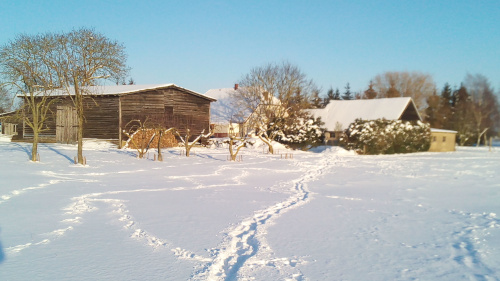
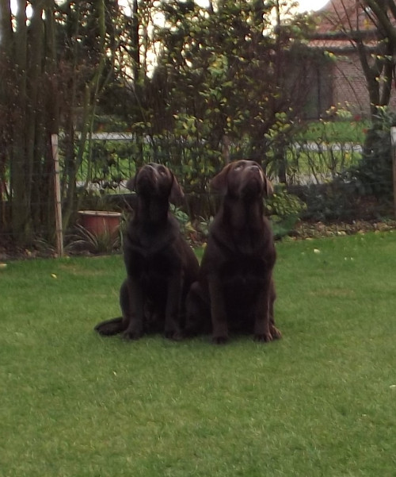

* <a href="https://rainerlueers.github.io/sophies-yard-chronicle/">Startseite</a>
* <a href="https://rainerlueers.github.io/sophies-yard-chronicle/rainers_software_portfolio.html">Rainer's Software Portfolio</a>

---
title: Sophies Yard Chronicle
---

## Geschichten von unserem kleinen Bauernhof  

Hallo und herzlich willkommen auf unserer Website.  
Wir, dass sind meine Frau Bernadette und ich, der Rainer und unsere beiden
Labradorhündinnen Laika und Lilly.  

Im Frühjahr 2015 haben Bernadette und ich den ehemaligen Reimer’s Hof in Sophienhof  
(Mecklenburg Vorpommern) gekauft. Seither sind wir kontinuierlich dabei, den
bereits 200 Jahre alten Bauernhof wieder in Stand zu setzen.  

<a href="#">Top</a> 
